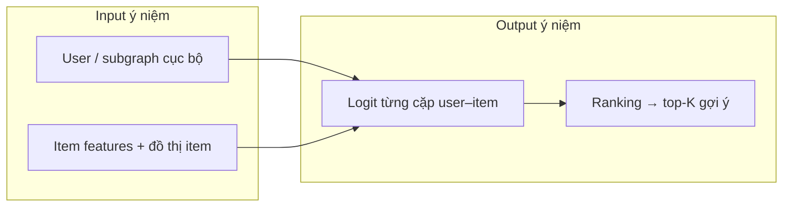
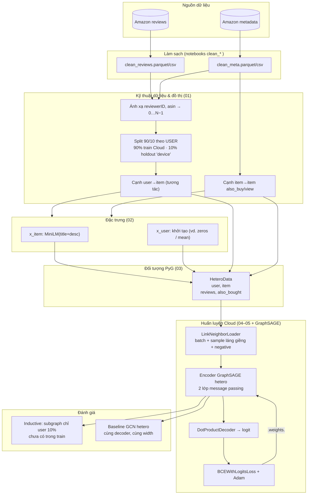
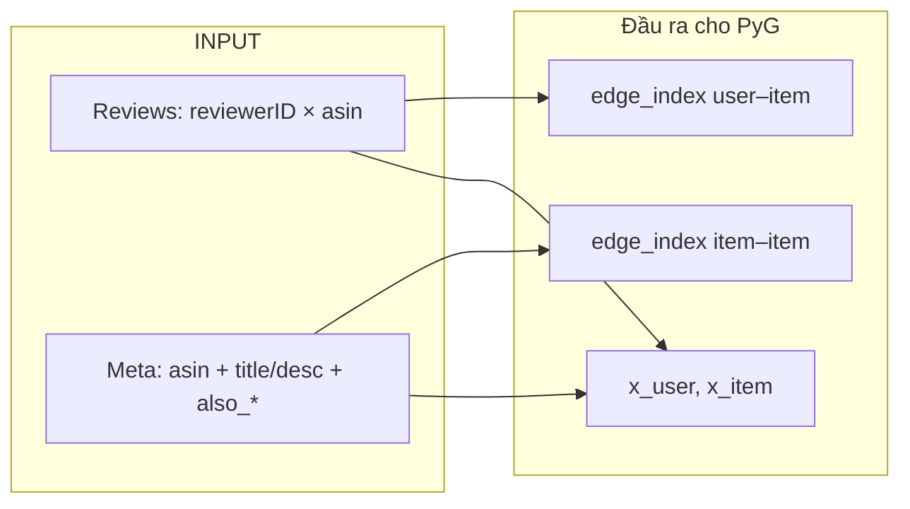
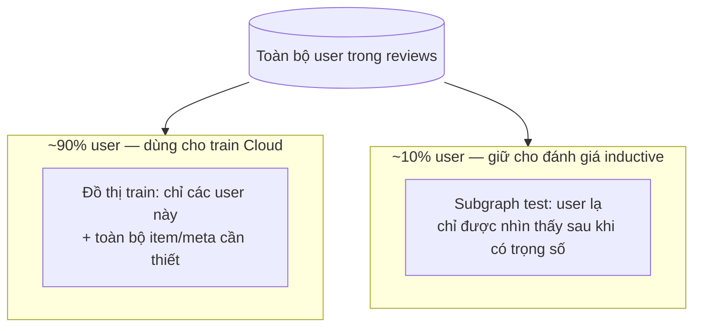
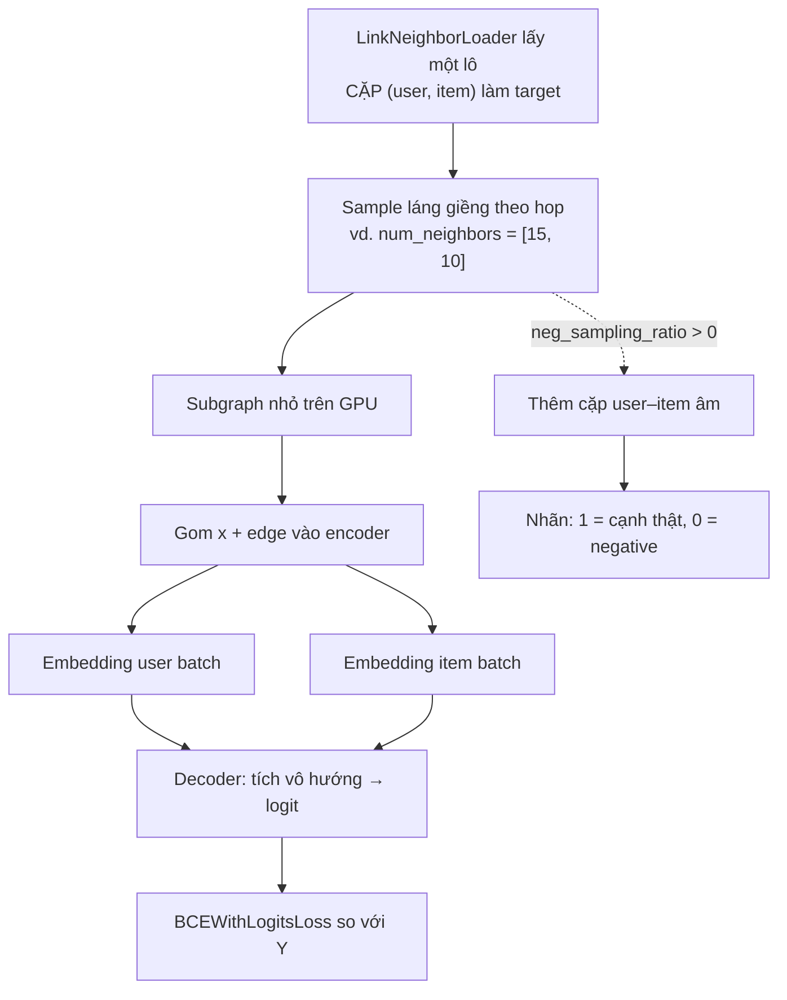
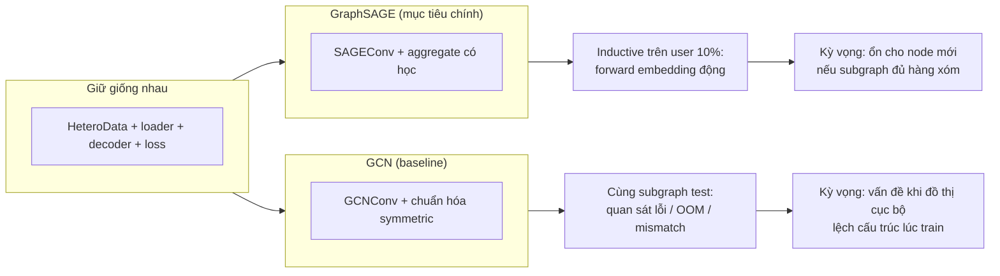

# Pipeline End-to-End — Device–Cloud GNN Recommender

Tài liệu này mô tả pipeline từ dữ liệu thô đến huấn luyện trên Cloud và kịch bản **user mới (inductive)**. Dùng để trình bày lại cho nhóm: bạn đang làm gì và các bước liên kết thế nào.

---

## 1. Một câu tóm tắt

**Xây một hệ gợi ý dựa trên đồ thị:** Cloud học một mạng GNN (GraphSAGE) trên đồ thị **user–item + item–item**, với đặc trưng item từ text; sau đó kiểm tra xem cùng kiến trúc có **suy luận được cho user chưa từng thấy lúc train** (chỉ dựa vào subgraph cục bộ + kiến thức global về item) hay không — và so sánh với **GCN** để thấy hạn chế **transductive**.

---

## 2. Input, output và ví dụ minh họa

### 2.1. Bài toán ở dạng một câu

Mô hình học trả lời: *“Với một **cặp (người dùng, sản phẩm)** trong một **ngữ cảnh đồ thị** (ai đã mua gì, sản phẩm nào hay đi cùng nhau), có khả năng họ sẽ **tương tác** (vd. mua / đánh giá) hay không?”*

- **Input (học máy):** đặc trưng của các node trong **một vùng subgraph** + chỉ số các cạnh trong vùng đó + **danh sách cặp (user, item)** cần chấm điểm.
- **Output (học máy):** một **logit** (số thực) cho **mỗi** cặp; logit cao ⇒ mô hình “tin” có tương tác. Khi train, logit được so với nhãn 0/1 qua `BCEWithLogitsLoss`.

### 2.2. Bảng từ dữ liệu thô → tensor

| Giai đoạn | Input gần với bạn nhất | Output / thành phẩm |
|-----------|-------------------------|------------------------|
| Dữ liệu gốc | File reviews + metadata Amazon | Bảng đã làm sạch (`clean_*`) |
| Đồ thị (notebook 01–03) | ID user/item, cạnh tương tác, cạnh also_buy | `HeteroData`: `x_user`, `x_item`, `edge_index` |
| Một bước train (04–05 + encoder) | Batch subgraph + cặp (user, item) + nhãn | Vector logit `[batch_size]` |

### 2.3. Ví dụ 1 — “Shop nhỏ” (trực giác)

Giả sử chỉ có **3 người** và **3 món**:

- User: **An**, **Bình**, **Chi**
- Item: **Tai nghe (T)**, **Bàn phím (B)**, **Chuột (C)**

**Lịch sử tương tác (cạnh user → item):**

- An đã mua: Tai nghe, Chuột  
- Bình đã mua: Bàn phím, Chuột  
- Chi đã mua: Tai nghe  

**Thông tin catalog (cạnh item ↔ item, ví dụ “thường mua cùng”):**

- Người mua Tai nghe hay xem thêm Chuột  
- Bàn phím hay đi với Chuột  

Trong pipeline, mọi nhân vật trên được gán **số** (0, 1, 2, …) để máy tính dùng tensor.

**Input của *một* phép hỏi mô hình:**

- Câu hỏi: *“An có nên được gợi ý **Bàn phím** không?”*  
  → Cặp mục tiêu **(An, Bàn phím)**.  
- Kèm theo: embedding/text feature cho T, B, C; đồ thị cục bộ (Ai nối với ai).

**Output:**

- Ví dụ: logit `+0.3` ⇒ hơi nghiêng về “có”, logit `-2.1` ⇒ “không”.  
- **Gợi ý cuối:** với An, chấm điểm T, B, C → **sắp xếp** theo logit giảm dần → thứ tự gợi ý (vd. C rồi T rồi B).

**Train với nhãn cụ thể (minh họa BCE):**

| Cặp (user, item) | Nhãn (có tương tác thật không?) | Ý nghĩa |
|------------------|----------------------------------|--------|
| (An, Chuột) | 1 | Đã mua thật — mô hình nên cho logit **cao** |
| (An, Bàn phím) | 0 | (Giả sử) chưa mua — negative mẫu — nên logit **thấp** |

Mô hình chỉnh trọng số để các cặp kiểu hàng 1 dồn logit lên, hàng 2 dồn xuống.

### 2.4. Ví dụ 2 — Một batch hai cặp (giống tinh thần PyG)

Giả sử batch có **2** cặp cần dự đoán:

1. (An, Chuột) — nhãn **1**  
2. (Bình, Tai nghe) — nhãn **0** (negative sampling: chọn một item Bình chưa mua)

**Input (khái niệm, không cần nhớ số chiều):**

- Tensor đặc trưng node trong **subgraph** lấy ra quanh các user/item này  
- `edge_index` các cạnh user–item và item–item **chỉ trong vùng đó**  
- Ma trận 2×2 chỉ số: hàng đầu chỉ số user, hàng hai chỉ số item ← đúng kiểu `edge_label_index`

**Output:**

- Hai số thực, ví dụ `[1.2, -0.8]` — mỗi số là logit cho một cặp tương ứng thứ tự trên.

Loader (`LinkNeighborLoader`) bảo đảm bạn **không** phải nạp cả “siêu đồ thị” mỗi lần; chỉ một **mẩu láng giềng**.

### 2.5. Ví dụ 3 — User “lạ” (inductive)

**Chi** nằm trong **10% user holdout**: khi train Cloud, bạn **không** dùng cạnh của Chi để cập nhật loss (tùy cách bạn cắt tách chính xác trong notebook — ý tưởng: Chi giống **user mới trên điện thoại**).

Sau khi train xong:

- Input suy luận vẫn là: subgraph cục bộ của Chi (những item Chi đã chạm tới trong tập test) + đặc trưng item từ Cloud.  
- Output vẫn là logit cho từng cặp (Chi, item ứng viên).

**Điểm cần nói cho mọi người:** bài test là “**chưa học trực tiếp** user này trong train” nhưng vẫn ra được điểm — đó là lý do dùng GraphSAGE và split theo user.

### 2.6. Ví dụ 4 — Góc Device–Cloud (ngôn ngữ kể)

| Ai giữ gì | Ví dụ phân vai |
|-----------|----------------|
| **Cloud** | Toàn bộ đồ thị item–item + tri thức text (MiniLM) + trọng số GNN sau train |
| **Device (Chi)** | Chỉ danh sách “Chi đã xem/mua gần đây” + vài sản phẩm lân cận |

Chi bấm “Gợi ý cho tôi”: thiết bị không nhất thiết gửi **nguyên lịch sử thô** lên server — trong lý thuyết đồ án, đủ để chạy encoder đã học trên **subgraph cục bộ** và ra **logit / xếp hạng**; đó là chỗ pipeline của bạn **đứng về phía “học và suy luận trên đồ thị”** (chi tiết triển khai MNN/TFLite là bước mở rộng).

---

## 3. Sơ đồ tổng quan (toàn pipeline)

**Ý chính:** dữ liệu hội tụ vào một **đồ thị dị thể** (hai loại node, hai loại quan hệ). Loader tạo **subgraph nhỏ** mỗi batch; encoder tạo embedding; decoder đánh giá **có nên có cạnh user–item không**; loss cập nhật **cả encoder lẫn decoder**.

---

## 4. Giai đoạn chuẩn bị đồ thị

### Vì sao từng loại dữ liệu

| Thành phần | Vai trò |
|------------|---------|
| **Cạnh user–item** | Tín hiệu “đã tương tác” — thứ mô hình học để ghi nhận sở thích. |
| **Cạnh item–item** | Tri thức **global** trên Cloud — item gần nhau trên catalog. |
| **x_item từ text (MiniLM)** | Mỗi sản phẩm có **ngữ nghĩa** ngay khi ít tương tác; GNN kết hợp topology + nội dung. |
| **x_user** | Placeholder cùng chiều cho PyG hetero; phần lớn tín hiệu user đến từ **hàng xóm trên đồ thị** sau các lớp conv. |

---

## 5. Split 90/10 theo user (trục inductive)

**Điểm cần nói khi thuyết trình:** nếu cùng một user vừa train vừa test, mô hình dễ **nhớ embedding** user (gần transductive). Chia theo user buộc xử lý **node user mới** — đúng tinh thần thiết bị có user mới hoặc ít lịch sử.

---

## 6. Một batch học link prediction (Cloud)

Mỗi bước không cần nhìn cả đồ thị; chỉ một **vùng cục bộ** — vừa khả thi quy mô lớn, vừa gần ý “tính toán local trên device”.

---

## 7. Hai nhánh đánh giá: GraphSAGE vs GCN

**Cách giải thích:** không phải “GCN dở” một cách mơ hồ, mà **GCN gắn chặt chuẩn hóa theo topology**; subgraph cô lập (user mới) có thể làm chuẩn hóa và representation **khác lúc train** — đó là điểm giáo dục của baseline.

---

## 8. Ánh xạ Device–Cloud với pipeline

| Thành phần trong pipeline | Cách nói với người nghe |
|---------------------------|-------------------------|
| Đồ thị item–item + MiniLM item | **Cloud** học catalog toàn cục và đặc trưng sản phẩm. |
| Cạnh user–item trên tập train | Lịch sử nhiều user góp vào học chung (mô phỏng dữ liệu tổng hợp trên server). |
| `LinkNeighborLoader` | Chỉ đưa **một phần láng giềng** mỗi bước — giống băng thông / bộ nhớ hạn chế. |
| User 10% holdout | User chỉ xuất hiện ở phía “thiết bị” sau khi trọng số cố định — **inductive**. |
| Trọng số GraphSAGE + (tùy triển khai) embedding item | Có thể **đóng gói gửi xuống**; thiết bị giữ subgraph cục bộ và chạy cùng kiến trúc conv. |

---

## 9. Trạng thái triển khai trong repo (tham chiếu `TODO.md`)

| Phần | Ghi chú |
|------|---------|
| Làm sạch dữ liệu | Notebooks `clean_*` |
| Đồ thị, mapping, split | `01_data_engineering.ipynb` |
| Đặc trưng | `02_feature_encoding.ipynb` |
| `HeteroData` | `03_hetero_data.ipynb` |
| Loader | `04_link_neighbor_loader.ipynb` |
| Decoder | `05_edge_decoder.ipynb` |
| GraphSAGE + train + inductive eval | `06_graphsage_train_eval.ipynb` — checkpoint `data/processed/graphsage_link_pred.pt` |
| GCN baseline + quan sát transductive | Cần bổ sung (mục 3.x trong TODO) |

**Hai tầng đánh giá:** (1) **Seen users** — `RandomLinkSplit` trên cạnh trong `hetero_data.pt` (cùng ~90% user train); AUROC/AP trên val/test khi `LinkNeighborLoader` bật negative sampling. (2) **Inductive** — đồ thị chỉ gồm ~10% user holdout + `hidden_interactions_test.parquet`; cùng trọng số encoder/decoder, metrics trên split cạnh riêng.

Pipeline **logic** là end-to-end; GraphSAGE đã có notebook train/eval; baseline GCN vẫn theo TODO mục 3.

---

## 10. Gợi ý trình bày (một buổi)

- **Slide trung tâm:** mục 3 (sơ đồ tổng quan).
- **Khi hỏi “input/output là gì”:** mục 2 (có ví dụ cửa hàng nhỏ + batch).
- **Khi hỏi “train cụ thể thế nào”:** mục 6 (một batch).
- **Khi hỏi “Device–Cloud là gì”:** mục 8 (bảng).
- **Khi hỏi “GraphSAGE khác GCN ra sao trong đồ án”:** mục 7.
