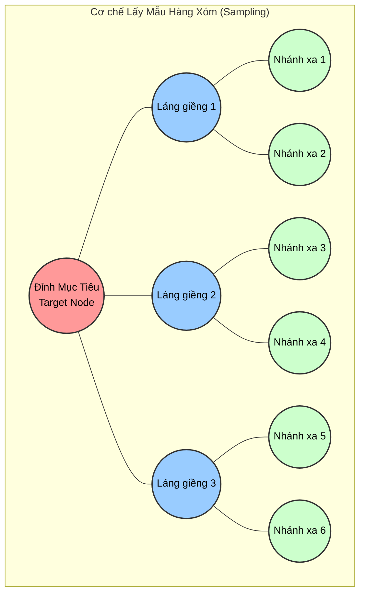
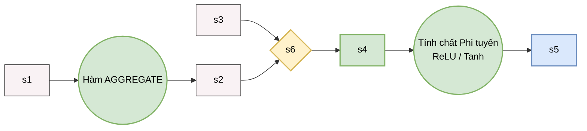
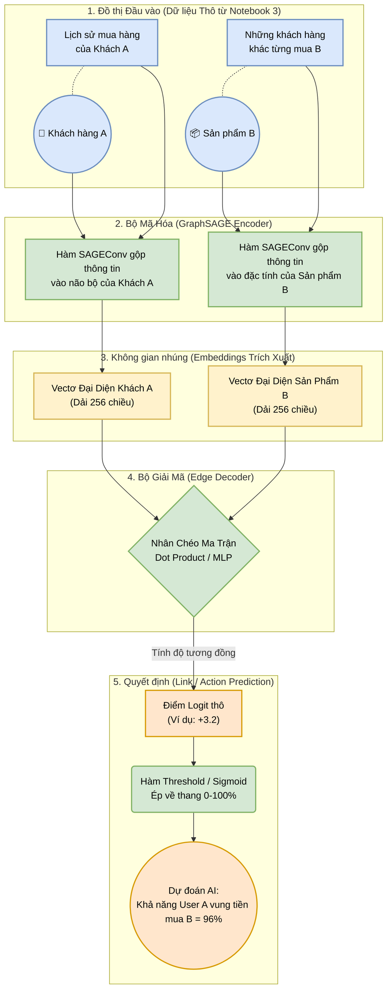
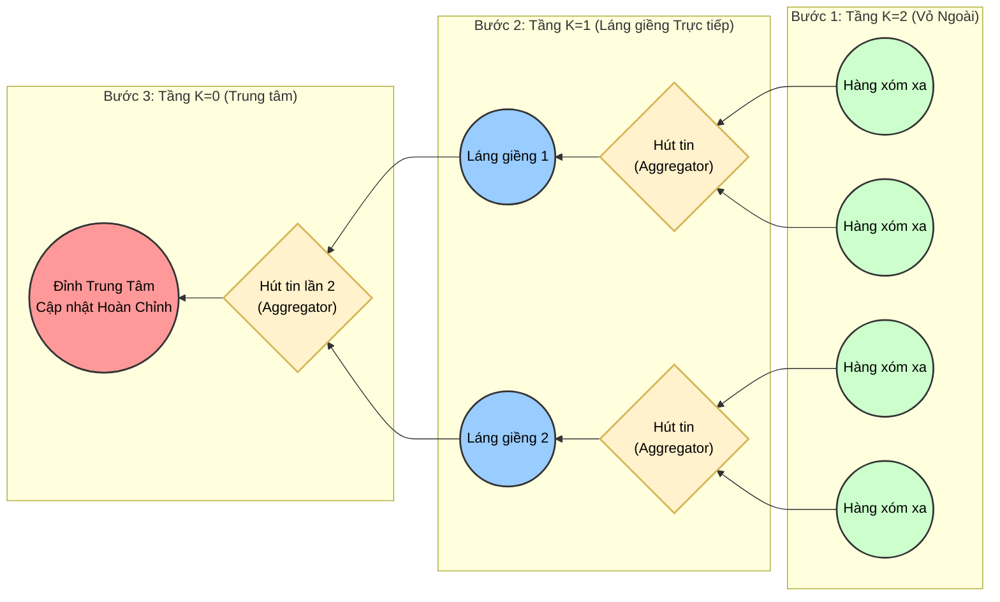
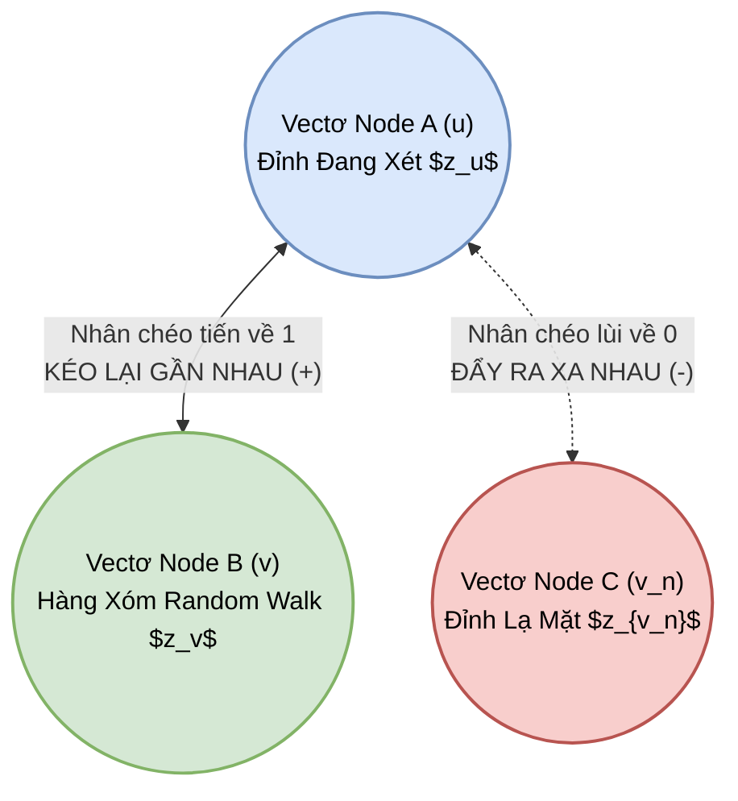

# 🧠 Giải Mã Chi Tiết Thuật Toán GraphSAGE
*(Tham khảo tài liệu gốc: Inductive Representation Learning on Large Graphs - Hamilton, Ying, Leskovec, Stanford University 2017)*

---

## 1. Vấn đề cốt lõi: GraphSAGE xử lý bài toán gì?
Trước khi GraphSAGE ra đời, các thuật toán như **GCN (Graph Convolutional Networks)** hoạt động theo cơ chế **Transductive (Học chuyển nạp)**. 
- Ngay từ lúc bắt đầu train, GCN yêu cầu **TOÀN BỘ** bức tranh đồ thị phải có mặt đầy đủ. GCN lập một cái ma trận cố định khổng lồ cho $N$ đỉnh và từ từ tối ưu hóa mảng số cho từng đỉnh cụ thể đó.
- **Nhược điểm chí tử:** Rất kém linh hoạt! Giả sử nay bạn vừa deploy model lên server, ngày mai có một User mới toanh tạo tài khoản App. GCN sẽ tê liệt vì ID của User này hoàn toàn "vắng mặt" trong cuốn danh sách ma trận lúc huấn luyện. Bạn bắt buộc phải **huấn luyện lại AI từ đầu (re-train)** với $N+1$ đỉnh. Quá trình này vô cùng đắt đỏ trong Big Data mạng xã hội.

**GraphSAGE (SAmple and aggreGatE)** tạo ra cuộc cách mạng nhờ lối tư duy **Inductive (Học quy nạp)**.
Thay vì cố bám víu "học thuộc lòng" từng cá nhân, GraphSAGE nói rằng: *"Tôi không thèm nhớ anh là ai. Tôi chỉ học **CÁCH** anh giao tiếp và chắt lọc thông tin từ những người bạn của anh."*
- Nhờ việc tập trung học *Quy luật hội tụ đặc trưng* (Aggregation function), khi bất ngờ có Node mới xuất hiện (ví dụ: Điện thoại của người dùng mới tinh ở nhánh Edge Device), hệ thống chỉ cần ngó xem các láng giềng xung quanh là ai, rồi áp dụng CÔNG THỨC đó để nhào nặn ra ngay một ma trận não (Embedding) mới cho họ trong nháy mắt.

---

## 2. Trái tim của Thuật toán: SAmple & aggreGatE
Đúng như cái tên viết tắt, linh hồn của GraphSAGE bao trọn 2 phân đoạn: `Lấy mẫu` và `Gộp tin`.

### A. Lấy Mẫu Hàng Xóm (Neighborhood Sampling)
Trong thực tế, một bài đăng (Node) có thể có 1 tỷ người bâu vào comment, 1 ông KOL có vài chục triệu follower. Nếu bắt con AI tính não bộ của Node này bằng cách ném hết đặc trưng của 10 triệu ông hàng xóm kia vào GPU, máy chủ lớn nhất thế giới cũng sập.
GraphSAGE sinh ra khái niệm: **Lấy mẫu theo cụm k-hop bị giới hạn (Fixed-size Neighborhood Sampling)**.
*   **Tầng 1 (Hop 1):** Chỉ bốc thăm ngẫu nhiên tối đa $S_1$ hàng xóm (VD: 15 người) bâu quanh Target. Ai nhiều hơn 15 thì random bốc 15, ai ít hơn 15 thì lấy hết (hoặc lấy lặp lại điểm ảnh để đủ 15).
*   **Tầng 2 (Hop 2):** Cứ mỗi một cá nhân trong tập 15 người ở trên, ta lại nhảy ra xa thêm 1 vòng và bốc thăm tối đa $S_2$ hàng xóm của họ (VD: 10 người).
-> Kết quả: Bất chấp anh là người vô danh hay Elon Musk, cái màng bọc thông tin mà máy phải tính toán mãi mãi chỉ là một đồ thị hình cây cố định quy mô nhỏ.

### B. Tổng hợp Thông tin (Aggregation Forward Propagation)
Sau khi tạo xong màng nhện lấy mẫu, GraphSAGE bắt đầu quá trình **Cuốn chả giò từ ngoài vào trong**:
1. Lấy thông tin đặc trưng (Features) của các điểm xanh lá, **Gộp lại (Aggregate)**, rồi truyền để update trí thức của điểm Xanh dương.
2. Lấy thông tin Xanh dương lúc này, tiếp tục **Gộp lại**, rồi truyền nâng cấp trí óc cho Target màu Đỏ.

#### Công thức toán học huyền thoại trong paper:
Với $k$ là bước nhảy (hop), $h$ là vectơ đặc trưng:
1. Gộp hàng xóm:
$$ h_{N(v)}^k = \text{AGGREGATE}_k (\{ h_u^{k-1}, \forall u \in N(v) \}) $$
2. Cập nhật bản thân (nối hàng xóm với mình rồi nhân Ma trận xoay chiều W):
$$ h_v^k = \sigma \left( W^k \cdot \text{CONCAT} (h_v^{k-1}, h_{N(v)}^k) \right) $$

**Cắt nghĩa bằng sơ đồ dòng chảy:**

**Sự đỉnh cao của toán tử CONCAT:**
Nhiều thuật toán cũ lấy đặc trưng của Bản thân đem trộn lẫn vào mẻ súp hàng xóm rồi chia trung bình. GrapSAGE khôn ngoan hơn: Nó dùng lệnh dán chuỗi (`CONCAT`). Nghĩa là nó bảo tồn nguyên vẹn "Bản sắc cá nhân" ($h_v^{k-1}$) đặt sát vách với "Ảnh hưởng của quần chúng" ($h_{N(v)}^k$). Trọng số thần kinh $W^k$ sẽ tự học cách phân phối xem một bài đăng bị ảnh hưởng bởi chính nội dung của nó bao nhiêu %, và bị dư luận dắt mũi bao nhiêu %.

---

## 3. Các loại Miệng phễu gom số (Aggregator Architectures)
Làm thế nào để đun 15 mảng số của 15 láng giềng thành 1 mảng số vô hướng mang tính chất đại diện cao nhất? Ở trang 5 của ấn bản PDF, tác giả thiết kế 3 loại "Hàm gom":

1. **Mean Aggregator (Kẻ Bình Dân Bắt Buộc):** Cứ việc lấy phép cộng chia trung bình cộng từng đặc điểm một của đám đông. Ưu điểm là siêu nhanh, gọn, nhưng nhược điểm là cào bằng thông tin, thằng xuất chúng cũng bằng thằng cá biệt. *(Trong project của bạn ở Notebook 06, code dùng param `aggr="mean"` chính là đang xài con này).*
2. **LSTM Aggregator (Ngài Phức Tạp Máy Móc):** Đút đám hàng xóm chạy dọc qua một Mạng học sâu bộ nhớ dọc (LSTM) chuyên trị phân tích câu chữ lịch sử. Vấn đề là đồ thị thả rơi tự do không có sự phân biệt thứ tự hàng xóm nào trước nào sau, nên tác giả phải xáo trộn ngẫu nhiên (random permutation) láng giềng trước khi đút vào. Độ biễu diễn rất sâu, nhưng train cực kỳ chậm.
3. **Pooling Aggregator (Chiêu Mộ Tinh Anh):** Cho mỗi người hàng xóm đi qua riêng rẽ một Mạng kết nối đầy đủ (MLP/Dense Layer) để biến hóa đặc trưng, sau đó áp dụng phép `Max-Pooling` từng khối cạnh. Ai nhô ra đặc điểm lồi nhất sẽ được đại diện. Nhặt tinh hoa rất đỉnh, được đánh giá là hiệu quả nhất trong paper.

---

## 4. Ánh xạ trực tiếp vào Data Engineering Project của bạn
Quay trở lại kiến trúc Device-Cloud đang xây dựng trong Notebook `01` tới `06`:

1. **Hệ thống Đám mây (Cloud):** Đóng vai trò là Mảnh đất huấn luyện. Các User và Item được công khai sẽ liên tục nhồi nhét, đào tạo AI qua hàng nghìn vòng (epoch) để con AI tìm được các Ma trận $W$ mượt mà nhất. Con AI biết rằng hễ có những người chơi đánh giá *Món A* thì có khả năng họ cũng có não bộ giống người dùng đánh giá *Món B*.
2. **Thiết bị Đầu cuối bí mật (Edge Device / Hidden Inductive Users):** Notebook tung ra 10% lượng người bí mật chôn giấu từ Notebook 01 ra. Thí nghiệm đưa ra cực đoan: Tẩy trắng đặc trưng của Users, cho chúng nạp toàn mảng Số 0 (`torch.zeros()`).
3. **Phép màu nảy ra:** Nhờ hàm `AGGREGATE`, thay vì đứng nhìn con số 0 trong bất lực, GraphSAGE lập tức đánh hơi vào cục Đồ thị đồ vật (Item node) mà chiếc Điện thoại này vừa chọt mua qua cạnh Review: Nó hút 384 cái đặc trưng dồn dập của Item về đắp vào cái mảng rỗng số 0. Từ mảng rỗng, cái điện thoại bừng sáng với bộ mặt mới, và bằng một cách diệu kỳ, AI giải mã ra được luôn là máy này sẽ chuẩn bị mua đồ vật gì tiếp theo với điểm AUROC cao chót vót. 

Đó là lý do mà bài báo gọi là **"Inductive Representation Learning"**: Máy tính tiến hóa từ học vẹt (Transductive), sang thấu hiểu vạn vật xung quanh để quy nạp thế giới (Inductive).

---

## 5. Trực quan hóa End-to-End Quá trình Dự đoán (User - Item Link Prediction)
Để đúc kết lại toàn bộ luồng chạy của mô hình (từ khi nạp dữ liệu đồ thị, qua bộ mã hóa, cho đến khi AI chốt hạ một người có thích một món đồ hay không), sự kết hợp giữa **GraphSAGE Encoder** (từ Notebook 06) và **Edge Decoder** (từ Notebook 05) tạo thành hệ thống End-to-End khép kín tuyệt đẹp dưới đây:

**Bức tranh này chứng minh sức mạnh của mô hình Khuyên nghị bằng Đồ thị (Graph Recommender System):** 
AI không bao giờ chỉ phán đoán mù quáng dựa trên CÁI TÊN của "Khách A" và "Sản Phẩm B". GraphSAGE đi xa hơn bằng cách bê toàn bộ **"gia phả lịch sử mua sắm"** của Khách A và **"kênh tệp khách hàng ruột"** của Đồ B đem lên bàn cân để xét duyệt chung (bù đắp phần thông tin khuyết thiếu). Điều này tạo ra khả năng Target Recommendation chính xác khủng khiếp!

---

## 6. Sự Hoàn Thiện Lý Thuyết Gốc: Chìa khóa Học Thuật của Stanford (GraphSAGE 2017)
Dù ứng dụng thực tiễn của chúng ta là Supervised (Có nhãn Mua/Không Mua - Notebook 06), nhưng để nắm trọn vẹn 100% tinh túy bài báo gốc của ĐH Stanford, bạn phải hiểu 2 cơ chế hàn lâm sau đây: thuật toán truyền ngược ngầm định, và khả năng tự học không cần nhãn (Unsupervised).

### 6.1 Thuật toán Nén Dần Theo Lớp (Algorithm 1 - Forward Passing)
Cái hay của SAGE là nó không ném thông tin bừa bãi. Để tạo ra bản nhúng ở hiện tại ($Hop = 0$), nó phải lùi về dĩ vãng xa nhất ($Hop = K$), và **Đẩy dữ liệu dồn ngược vào Tâm (Outside-in)**.
- Với $K=2$, tại lớp ngoài cùng, mọi Node (kể cả Hàng xóm của Hàng xóm) chỉ là những vectơ đục lỗ thô ráp (Ví dụ: Bài mô tả sản phẩm vỡ vụn).
- Tầng $k=1$ (Hàng xóm trực tiếp): Hút Mảng Số của lớp $K=2$ vào và nâng cấp não bộ của chúng.
- Tầng $k=0$ (Bản thân Target Node): Cuối cùng mới hút Mảng Số tinh hoa của tụi $k=1$ vào mình. Quá trình này được thực thi bằng các Vòng lặp `for` chạy giật lùi trong Algorithm 1 của Bài báo.

### 6.2 Tuyệt kỹ Hàm Suy Diễn Mù (Unsupervised Random Walk Loss)
GraphSAGE nguyên thủy nổi tiếng vì có thể tự nhiên khôn lên mà **KHÔNG CẦN CHỈ ĐỊNH nhãn 0 hay 1**. Làm sao nó biết 2 Node có điểm chung để nặn ra 2 Embedding giống hệt nhau?
Câu trả lời nằm ở thiết kế hàm Lỗi tự thân qua trò chơi **"Người Hàng Xóm Ngẫu Nhiên" (Random Walk)**.
1. Nếu ta bắt đầu nhắm mắt đi loạng choạng từ Node A, và trôi dạt vào Node B sau vài bước $\rightarrow$ A và B phải có sự thân thiết bí ẩn **(Phải dính nhau / Positive Pull)**.
2. Cùng lúc đó, bốc bừa một người lạ hoắc ở đầu kia bán cầu C $\rightarrow$ A và C không đội trời chung **(Phải đẩy nhau ra / Negative Push)**.

#### Hàm Mất mát Nguyên Thủy (GraphSAGE Unsupervised Loss $\mathcal{J}_G$):
$$ \mathcal{J}_G (z_u) = - \log \left( \sigma(z_u^\top z_v) \right) - Q \cdot \mathbb{E}_{v_n \sim P_n(v)} \left[ \log \left( \sigma(- z_u^\top z_{v_n}) \right) \right] $$

**Sơ đồ khối Trực quan hóa Cơ chế "Kéo - Đẩy" của Random Walk Loss:**

**Kết luận:** 
Hàm Mất Mát Unsupervised đóng vai trò như lực hút Nam châm. Vectơ (Representation) của 2 đỉnh hay "đi bộ dạo" vấp phải nhau sẽ bị bóp nghẹt lại để mang ý nghĩa y chang nhau. Trong khi màng lọc Tỷ lệ $Q$ (Negative Sampling) lại phát ra từ trường ĐẨY hàng triệu đỉnh lạ xẹt xa nhau. Khi Âm-Dương này ổn định, thuật toán SAGE sẽ tự tạo ra một `Không Gian Nhúng (Embedding Space)` hoàn hảo nhất mà sự can thiệp thủ công gán nhãn của con người không bao giờ chạm tới được!
